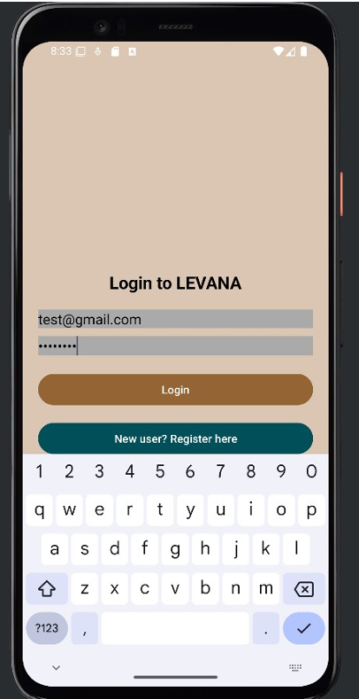
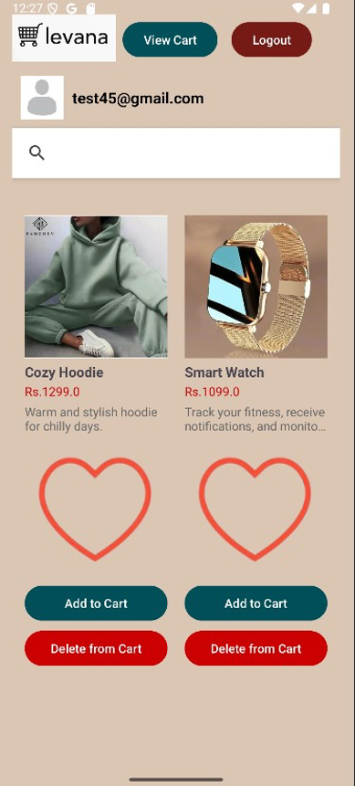
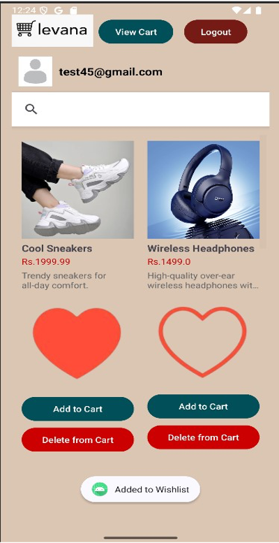
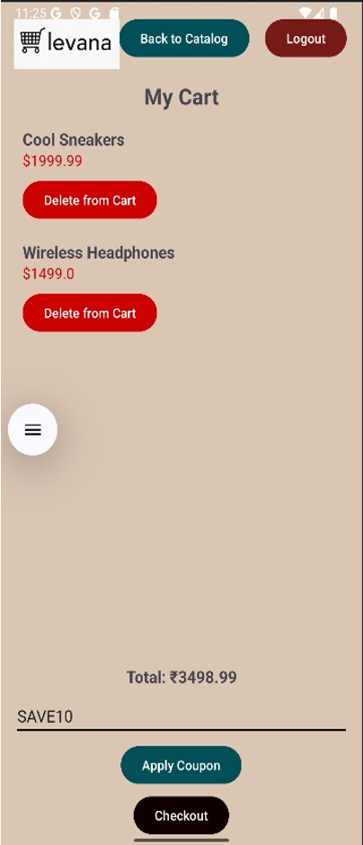

# E-Commerce App 🛒

An Android-based ecommerce application using Firebase for authentication, product management, and wishlist functionality.

## Features
- User Authentication (Email + Google Sign-In)
- Product Catalog with RecyclerView and SearchView filtering
- Wishlist Toggle: Add/remove favorite products (synced with Firestore)
- Cart: Add items to cart and view in a separate activity
- Firebase Firestore Integration for product and user data

## Tech Stack + Tools
Java · XML Layouts · Android Studio · Firebase · Firestore

## Output
| Login | Product Catalog | Wishlist | Cart |
|-------|------------------|----------|------|
|  |  |  |  |

## Getting Started

1. Clone the repository:
   ```bash
   git clone https://github.com/yourusername/EcommerceApp.git
2. Open in Android Studio.

3. Add your google-services.json file to the /app directory.

4. Sync Gradle and run the app on an emulator or real device.

## Firebase Setup
Make sure the following are configured in your Firebase Console:

- Enabled Email and Google Sign-in methods in Firebase Authentication
- Created a Firestore database (in test mode or with appropriate rules)
- Added documents to the products collection
- Placed your google-services.json in the /app directory of the project

## Contributors
- Sara Joshi - Add/ Delete from Cart, Discount Coupon Integration, Checkout Flow, Payment & Order Confirmation screens
- Ira Malik - Product Catalog, Firestore Integration, Wishlist, Real-Time Search Filtering, Product Details
- Nishita Jain - Home & Login Page Design, Firebase Setup & Authentication, Google Sign-In Integration
